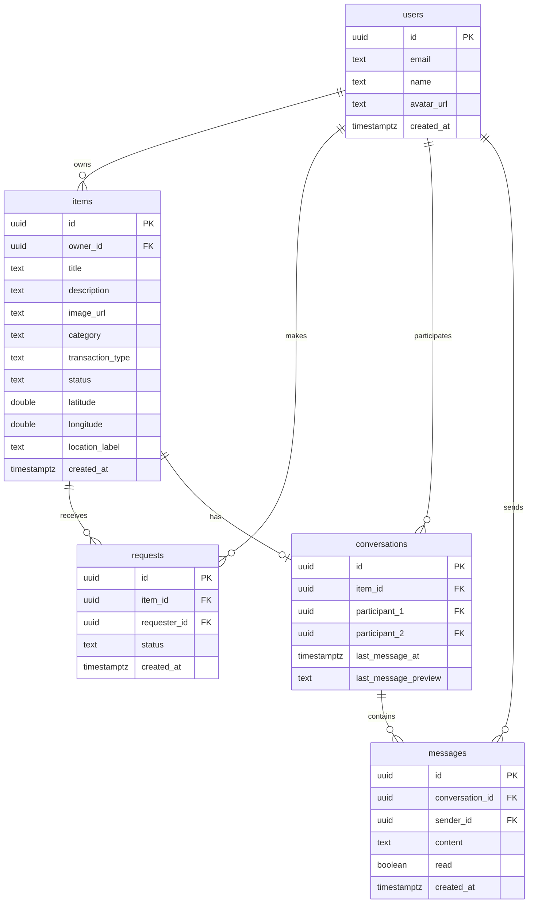

<div align="center">

# 📦 ShareZone

### *bảng tin đồ dùng thành phố*

**Kết nối người dân qua những món đồ nhỏ — cho tặng, cho mượn, trao đổi trong thành phố của bạn.**

[](https://reactjs.org/)
[](https://www.typescriptlang.org/)
[](https://vitejs.dev/)
[](https://tailwindcss.com/)
[](https://supabase.com/)
[](https://leafletjs.com/)
[](./LICENSE)

[🚀 Live Demo](#-demo) • [✨ Tính năng](#-tính-năng) • [🎨 Thiết kế](#-thiết-kế) • [🛠️ Cài đặt](#-cài-đặt) • [📚 Tài liệu](#-tài-liệu)

</div>

---

## 🎯 Vấn đề

Mỗi ngày, hàng ngàn món đồ tốt vẫn còn dùng được bị vứt bỏ trong khi người khác gần đó đang cần chúng. Sinh viên ra trường để lại giáo trình, đồ gia dụng. Người chuyển nhà bỏ lại quạt, nồi cơm, sách... trong khi hàng xóm cách đó vài trăm mét đang tìm đúng những thứ đó.

**ShareZone** là một "bảng tin khu phố" kỹ thuật số — nơi mọi người trong thành phố có thể đăng đồ không dùng nữa, và người cần có thể tìm thấy, xin, mượn, hoặc trao đổi. Đơn giản, thân quen, như cách hàng xóm vẫn giúp nhau.

## ✨ Tính năng

### 📝 Đăng & chia sẻ đồ dùng
- Form đăng đồ đầy đủ: tên, mô tả, ảnh, danh mục, loại giao dịch
- 5 danh mục: sách, điện tử, đồ gia dụng, quần áo, khác
- 3 loại giao dịch: cho tặng, cho mượn, trao đổi
- Chọn vị trí từ 24+ địa điểm thực tế khắp TP.HCM

### 🗺️ Bản đồ tương tác
- Hiển thị tất cả món đồ trên bản đồ OpenStreetMap
- Marker phân biệt màu theo trạng thái (xanh rêu / cam đất)
- Popup dạng "mảnh giấy dán" với thông tin chi tiết
- **Định vị GPS** — tìm món đồ gần bạn nhất
- Fallback tile server khi OSM chính bị lỗi

### 🔍 Tìm kiếm & lọc
- Tìm kiếm theo tên, mô tả
- Lọc theo danh mục, loại giao dịch, trạng thái
- Sắp xếp: mới nhất / gần nhất
- Toggle giữa chế độ danh sách và bản đồ

### 💬 Chat trực tiếp
- Nhắn tin giữa chủ đồ và người yêu cầu
- Danh sách cuộc trò chuyện với preview tin nhắn cuối
- Badge đếm tin nhắn chưa đọc
- Giao diện chat dạng "mảnh giấy" xoay nhẹ

### 🔔 Quản lý yêu cầu
- Người dùng gửi yêu cầu nhận đồ
- Chủ đồ xác nhận / từ chối
- Trạng thái tự động cập nhật: có sẵn → có người hỏi → đã trao xong
- Trang riêng "Đồ của tôi" và "Yêu cầu của tôi"

### 🔐 Xác thực
- Đăng ký / đăng nhập bằng email
- Demo accounts có sẵn để test nhanh
- Sẵn sàng tích hợp Supabase Auth

## 🎨 Thiết kế

> *"Không phải sàn giao dịch lạnh lùng, mà là sổ tay/bảng tin khu phố — thân quen, thủ công, đáng tin."*

### Bảng màu

| Tên | Mã | Vai trò |
|-----|-----|---------|
| 🟡 Giấy ngà | `#FAF6EE` | Nền chính |
| 🟤 Mực nâu-đen | `#262019` | Chữ chính |
| 🟢 Xanh rêu | `#566B4F` | Chủ đạo, nút bấm, marker "có sẵn" |
| 🟠 Cam đất | `#B5622C` | Cảnh báo, marker "có người hỏi" |
| 🟡 Vàng bơ | `#D9A441` | Tag, nhãn nhỏ |
| ⚫ Xám chì | `#8C8577` | Text phụ, viền nhẹ |

### Typography

- **Tiêu đề**: [Fraunces](https://fonts.google.com/specimen/Fraunces) (serif) — weight 600-700, có italic cho lời dẫn
- **Nội dung**: [Inter](https://fonts.google.com/specimen/Inter) (sans-serif) — line-height 1.6

### Phong cách đặc trưng

- ✨ **Dấu mộc (stamp)** cho trạng thái món đồ — viền dashed, xoay nhẹ -3deg
- 📌 **Animation "ghim đồ"** khi đăng mới — trượt nhẹ vào đầu danh sách
- 🗺️ **Marker hình tròn** thay vì pin giọt nước mặc định
- 📄 **Popup dạng giấy dán** — nền giấy ngà, xoay -1deg
- 💬 **Bubble chat** — xoay ±0.5deg như mảnh giấy thủ công
- 🖼️ **Minh họa nét vẽ tay** cho trạng thái rỗng

## 🖼️ Screenshots

<div align="center">

### Trang chủ — Danh sách dạng "dòng ghi chú trong sổ tay"


### Bản đồ — Marker phân biệt theo trạng thái


### Chi tiết món đồ — Với dấu mộc trạng thái


### Chat — Giao diện dạng "mảnh giấy"


</div>

> 💡 **Mẹo**: Thay các link placeholder bằng ảnh thật khi push lên GitHub bằng cách chụp màn hình và upload vào thư mục `docs/screenshots/`.

## 🛠️ Tech Stack

### Frontend
- ⚛️ **React 18** + **TypeScript 5.7** — UI framework
- ⚡ **Vite 6** — Build tool siêu nhanh
- 🎨 **Tailwind CSS 4** — Utility-first styling
- 🧭 **React Router 6** — Client-side routing
- 🎭 **Lucide React** — Icon system
- 📅 **date-fns** — Date formatting

### Maps
- 🗺️ **Leaflet** + **react-leaflet** — Interactive maps
- 🌍 **OpenStreetMap** — Free tile server
- 📍 **Geolocation API** — User location

### Backend (Optional)
- 🗄️ **Supabase** — PostgreSQL + Auth + Storage + Realtime
- 🔐 **Row Level Security** — Fine-grained access control

### State Management
- 💾 **React Context** + **localStorage** — Demo mode
- 🔄 **Supabase Client** — Production mode

## 📦 Cài đặt

### Yêu cầu
- Node.js 18+ 
- npm hoặc yarn

### 1. Clone repository

```bash
git clone https://github.com/yourusername/sharezone.git
cd sharezone
```

### 2. Cài đặt dependencies

```bash
npm install
```

### 3. Chạy chế độ demo (không cần Supabase)

```bash
npm run dev
```

Mở trình duyệt tại `http://localhost:5173`

**Demo accounts** (mật khẩu bất kỳ):
- `minh@demo.com`
- `lan@demo.com`
- `hung@demo.com`
- `hoa@demo.com`
- `tung@demo.com`

### 4. (Optional) Cấu hình Supabase

Xem hướng dẫn chi tiết tại [SUPABASE_SETUP.md](./SUPABASE_SETUP.md)

```bash
# Copy file .env.example thành .env
cp .env.example .env

# Điền thông tin Supabase vào .env
VITE_SUPABASE_URL=https://your-project.supabase.co
VITE_SUPABASE_ANON_KEY=your-anon-key

# Chạy SQL migration trong Supabase SQL Editor
# File: supabase/migrations/001_initial_schema.sql

# Tạo Storage bucket 'item-images' (public)

# Restart dev server
npm run dev
```

## 📁 Cấu trúc Project

```
sharezone/
├── 📂 src/
│   ├── 📂 components/          # UI components
│   │   ├── Navbar.tsx          # Header + navigation
│   │   ├── ItemRow.tsx         # Item card (list view)
│   │   ├── MapView.tsx         # Map component
│   │   └── EmptyIllustration.tsx
│   │
│   ├── 📂 pages/               # Route pages
│   │   ├── HomePage.tsx        # Danh sách + toggle bản đồ
│   │   ├── MapPage.tsx         # Bản đồ toàn màn hình
│   │   ├── AddItemPage.tsx     # Form đăng đồ
│   │   ├── ItemDetailPage.tsx  # Chi tiết món đồ
│   │   ├── AuthPage.tsx        # Đăng nhập/đăng ký
│   │   ├── MyItemsPage.tsx     # Đồ tôi đã đăng
│   │   ├── MyRequestsPage.tsx  # Yêu cầu của tôi
│   │   ├── MessagesPage.tsx    # Danh sách chat
│   │   └── ConversationPage.tsx # Chi tiết chat
│   │
│   ├── 📂 store/
│   │   └── AppContext.tsx      # State management (localStorage)
│   │
│   ├── 📂 lib/
│   │   └── supabase.ts       # Supabase client & helpers
│   │
│   ├── 📂 data/
│   │   └── seedData.ts       # 15 món đồ mẫu khắp TP.HCM
│   │
│   ├── types.ts              # TypeScript types
│   ├── App.tsx               # Main app component
│   ├── main.tsx              # Entry point
│   └── index.css             # Tailwind + custom styles
│
├── 📂 supabase/
│   └── 📂 migrations/
│       └── 001_initial_schema.sql  # Database schema + RLS
│
├── .env.example              # Environment template
├── SUPABASE_SETUP.md         # Hướng dẫn Supabase chi tiết
├── README.md                 # File này
└── package.json
```

## 🗄️ Database Schema



### Row Level Security

Tất cả bảng đều bật RLS với policies chi tiết:

- ✅ **Users**: Ai cũng xem, chỉ sửa profile của mình
- ✅ **Items**: Ai cũng xem, chỉ chủ sở hữu sửa/xóa
- ✅ **Requests**: Ai cũng xem, chỉ người tạo sửa
- ✅ **Conversations**: Chỉ người tham gia mới xem
- ✅ **Messages**: Chỉ người tham gia conversation mới xem/gửi

## 🚀 Scripts

```bash
npm run dev          # Khởi động dev server (http://localhost:5173)
npm run build        # Build production (dist/)
npm run preview      # Preview production build
npm run typecheck    # Kiểm tra TypeScript errors
```

## 🎯 Routes

| Route | Component | Mô tả |
|-------|-----------|-------|
| `/` | `HomePage` | Danh sách món đồ + toggle bản đồ |
| `/map` | `MapPage` | Bản đồ toàn màn hình |
| `/add` | `AddItemPage` | Form đăng đồ mới |
| `/item/:id` | `ItemDetailPage` | Chi tiết món đồ |
| `/auth` | `AuthPage` | Đăng nhập / đăng ký |
| `/my-items` | `MyItemsPage` | Đồ tôi đã đăng |
| `/my-requests` | `MyRequestsPage` | Yêu cầu của tôi |
| `/messages` | `MessagesPage` | Danh sách cuộc trò chuyện |
| `/messages/:id` | `ConversationPage` | Chi tiết cuộc trò chuyện |

## 🔒 Security

- 🔐 **Row Level Security** cho tất cả bảng
- 🗝️ **Anon key** chỉ dùng cho client-side
- 🛡️ **Service role key** không bao giờ commit lên git
- 📝 **Environment variables** trong `.env` (đã thêm vào `.gitignore`)

## 🛣️ Roadmap

### Phase 1 — MVP ✅
- [x] Đăng đồ với form đầy đủ
- [x] Danh sách + lọc + tìm kiếm
- [x] Bản đồ với marker phân biệt trạng thái
- [x] Chi tiết món đồ
- [x] Luồng yêu cầu + xác nhận
- [x] Chat giữa chủ đồ và người yêu cầu
- [x] Định vị GPS
- [x] Supabase schema + RLS

### Phase 2 — Enhancement 🚧
- [ ] Upload ảnh thật (Supabase Storage)
- [ ] Realtime chat với Supabase Realtime
- [ ] Thông báo push (Web Push API)
- [ ] Đánh giá uy tín người dùng
- [ ] Lịch sử giao dịch

### Phase 3 — Scale 🌟
- [ ] Multi-city support
- [ ] Admin dashboard
- [ ] Analytics & insights
- [ ] Mobile app (React Native)
- [ ] AI-powered matching (gợi ý món đồ phù hợp)

## 🤝 Đóng góp

Mọi đóng góp đều được chào đón! Đây là dự án mã nguồn mở.

1. Fork repo
2. Create feature branch (`git checkout -b feature/AmazingFeature`)
3. Commit changes (`git commit -m 'Add AmazingFeature'`)
4. Push to branch (`git push origin feature/AmazingFeature`)
5. Open Pull Request

### Convention

- Commit messages: [Conventional Commits](https://www.conventionalcommits.org/)
- Code style: Prettier + ESLint
- Branch naming: `feature/`, `fix/`, `docs/`, `refactor/`

## 📄 License

Dự án này được phân phối dưới giấy phép MIT — xem file [LICENSE](./LICENSE) để biết chi tiết.

```
MIT License

Copyright (c) 2024 ShareZone

Permission is hereby granted, free of charge, to any person obtaining a copy
of this software and associated documentation files (the "Software"), to deal
in the Software without restriction...
```

## 🙏 Acknowledgments

- 🗺️ [OpenStreetMap](https://www.openstreetmap.org/) — Bản đồ miễn phí
- 🎨 [Leaflet](https://leafletjs.com/) — Thư viện bản đồ nhẹ
- 🎭 [Lucide](https://lucide.dev/) — Icon system đẹp
- 📚 [Supabase](https://supabase.com/) — Backend-as-a-service
- 🎨 [Fraunces Font](https://fonts.google.com/specimen/Fraunces) — Typography có cá tính
- 🎨 [Inter Font](https://fonts.google.com/specimen/Inter) — Sans-serif dễ đọc

## 📧 Liên hệ

**Được xây dựng cho hackathon** — Nền tảng chia sẻ đồ dùng thành phố.

- 🐛 Báo lỗi: [GitHub Issues](https://github.com/yourusername/sharezone/issues)
- 💡 Đề xuất tính năng: [GitHub Discussions](https://github.com/yourusername/sharezone/discussions)

---

<div align="center">

**⭐ Nếu bạn thấy dự án này hữu ích, hãy cho nó một star!**

Made with ❤️ for the community

[⬆ Back to top](#-sharezone)

</div>
